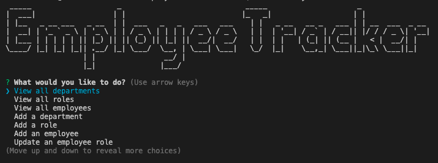

# Employee Tracker 🖥️

## Table of Contents

- [Table of Contents](#table-of-contents)
- [Description](#description)
- [User Story](#user-story)
- [Installation](#installation)
- [Screenshot for menu prompt](#screenshot-for-menu-prompt)
- [Walkthrough Video](#walkthrough-video)
- [Questions](#questions)

## Description  
- Employee tracker is a command-line application for business owners to manage a company's employee database. It's developed using Node.js, Inquirer, and MySQL.

## User Story
- As a business owner, I want to be able to view and manage the departments, roles, and employees in my company, so that I can better organize and plan my business.

## Installation
- Node.js installation is required to run this command-line application. 

## Screenshot for menu prompt

## Walkthrough Video
- [URL for Walkthrough Video](https://drive.google.com/file/d/1SOXgb-KhJy3vfEwnfiB3CX_ly4cP3TMh/view?usp=sharing)

## Questions
- For more projects, please visit my [GitHub](https://github.com/elenaliu0415). 
- Please feel free to contact me at elenaliu0415@gmail.com
